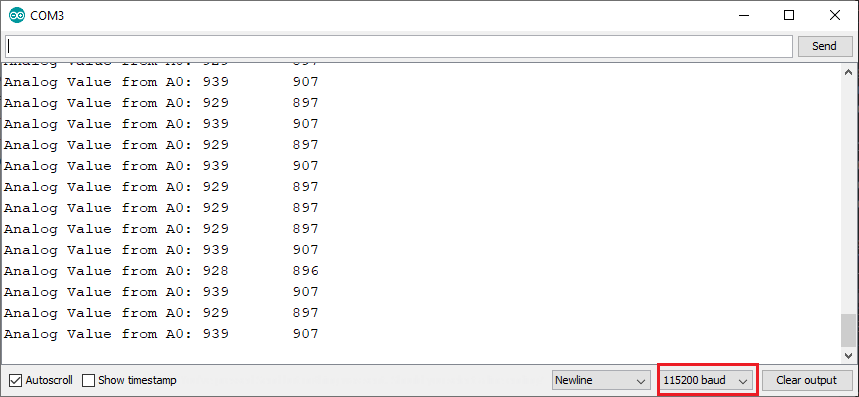

# Introduction
This repo contains the code required to set up the MQTT game. The purpose is to teach students about how MQTT works in a fun manner.

## The game
The objective of the game is to keep your team's score within the published range at the topic `/team_name/target`. You publish your current output to `/team_name/members/[your name]`. The score is determined by the difference between your team's current result and the target.

## Structure
The code is split up into two portions: the server and the client side. The client side will host the Arduino code that reads the sensors while the server side will host the game server that keeps track of the scores

| Topics | Comment |
| ------ | ------- |
|`siot_mqtt/hello`|Test topic that prints a hello message|
|`siot_mqtt/scores/[team]/current_score`| Current score for the team |
|`siot_mqtt/target/[team]/current_reading` | Current reading for the team |
|`siot_mqtt/target/[team]/current_target` | Current target for the team |
|`siot_mqtt/[team]/[team_member]`| The input of each team member |

# Embedded 
The embedded part of this project uses a `Node 0.9` ESP8266 board with a CP2102 IC.

> The CP2102 IC is very important. A lot of boards being sold are still using the old CH340G USB-UART IC, which is incompatible with many modern systems, requiring installs of drivers from sketchy websites. The CP2102 is made by Silicon Labs and has worked on Linux, Windows, and Mac devices

## Install
1. Install the Arduino IDE from https://www.arduino.cc/en/software
2. Open `File` > `Preferences`. Under `Additional Boards Manager URLs` paste in `http://arduino.esp8266.com/stable/package_esp8266com_index.json`
3. Open `Tools` > `Boards`. Select `Board Manager`. In the search bar, type in "esp8266", and install the first option.

## Setup
1. Open `Tools` > `Board`. Select `NodeMCU 0.9 (ESP-12 Module)` from the list.
2. Open `Tools` > `Port`. Select the port that appears when you plug the module in.

## Usage
1. After editing your code, Open `Sketch` > `Upload` to upload it to your board.
2. The standard baud rate used in the examples is `115200`. If nothing is appearing or nonsense is being printed, check this value in the Serial Monitor.

# Arduino Challenges
1. Wiring up the project for LEDs
2. Blinking an LED
3. Wiring up the project for buttons
4. Blinking the LED with button inputs
5. Wiring up the project for LDRs
6. Reading the LDR value in Serial Monitor
7. Reading the LDR value in Serial Plotter
8. Connecting to WiFi
9. Reading topics
10. Posting values + reading other people's topics
11. 

# Todo
1. Need to restrict topics related to the score and target portion
2. Arduino needs to read the incoming topic 